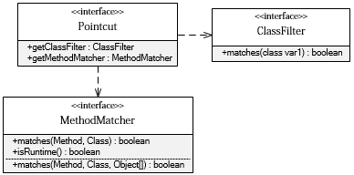

#Java Primer
> Java is a huge knowledge system, but the main is the accumulation of the code. More code, more feel. 
> place holder


## Spring AOP基础
摘抄《精通Spring4.x 企业应用开发实践》第7章 Spring AOP基础。

AOP是Aspect Oriented Programming的简称，最初被译为"面向方面编程"，这个翻译向来为人诟病，但是由于先入为主的效应，受众广泛，所以这个翻译依然被很多人使用，但我们更倾向于用"面向切面编程"的译法，因为它更加达意。

### AOP的由来

按照软件重构思想的理念，如果多个类中出现相同的代码，应该考虑定义一个共同的抽象类，**将这些相同的代码提取到抽象类中**。比如Horse、Pig、Camel这些对象都有run()、eat()的方法，通过引入一个包含这两个方法抽象的Animal父类，Horse、Pig、Camel就可以通过继承Animal复用到run()和eat()的方法。

**通过引入父类消除多个类中重复代码的方式**在大多情况下是可行的。但世界并非永远这样简单，请看下面论坛管理业务类的代码

```java
public class ForumService {  
    private TransactionManager transManager;  
    private PerformanceMonitor pmonitor;  
    private TopicDao topicDao;  
    private ForumDao forumDao;  
  
    public void removeTopic(int topicId) {  
        pmonitor.start();//①-1性能监控开始  
        transManager.beginTransaction();//②-1 事务处理开始  
  
        topicDao.removeTopic(topicId); //③-1 业务逻辑  
  
        transManager.commit();//②-1事务处理结束  
        pmonitor.end();//①-2 性能监控结束  
    }  
    public void createForum(Forum forum) {  
        pmonitor.start();//①-1性能监控开始  
        transManager.beginTransaction();//②-1 事务处理开始  
  
        forumDao.create(forum); //③-2 业务逻辑  
  
        transManager.commit();//②-1事务处理结束  
        pmonitor.end();//①-2 性能监控结束  
    }  
    …  
}


```

①的代码是方法性能监视代码，它在方法调用前启动，在方法调用返回前结束，并在内部记录性能监视的结果信息。  而②的代码是事务开始和事务提交的代码。我们发现③处的业务代码淹没在重复化非业务性的代码之中，性能监视和事务管理这些非业务性代码葛藤缠树般包围着业务性代码。 假设我们将ForumService业务类看成一段圆木，将removeTopic()和createForum()方法分别看成圆木的一截，我们会发现性能监视和事务管理的代码就好像一个年轮，而业务代码是圆木的树心，这也正是横切代码概念的由来。   

	我们无法通过抽象父类的方式消除以上所示的重复性横切代码，因为这些横切逻辑依附在业务类方法的流程中，它们不能转移到其他地方去。 AOP独辟蹊径通过横向抽取机制为这类无法通过纵向继承体系进行抽象的重复性代码提供了解决方案。对于习惯了纵向抽取的开发者来说，可能不容易理解横向抽取方法的工作机制，因为Java语言本身不直接提供这种横向抽象的能力，我们暂把具体实现放在一旁，先通过图解的方式归纳出AOP的解决思路。

 

 从图6-2中，我们可以看出AOP希望将这些分散在各个业务逻辑代码中的相同代码，通过横向切割的方式抽取到一个独立的模块中，还业务逻辑类一个清新的世界。 

 **当然，我们知道将这些重复性的横切逻辑独立出来是很容易的，但如何将这些独立的逻辑融合到业务逻辑中完成和原来一样的业务操作，这才是事情的关键，也正是AOP要解决的主要问题。**  


### AOP术语

- 连接点(JoinPoint)
  程序执行的某个特定位置：如类开始初始化前、类初始化后、类某个方法调用前、调用后、方法抛出异常后。
  一个类或一段程序代码拥有一些具有边界性质的特定点，这些代码中的特定点就称为“连接点”。Spring仅支持方法的连接点，即仅能在方法调用前、方法调用后、方法抛出异常时以及方法调用前后这些程序执行点织入增强。
  连接点由两个信息确定：第一是用方法表示的程序执行点；第二是用相对点表示的方位。如在Test.foo()方法执行前的连接点，执行点为Test.foo()，方位为该方法执行前的位置。Spring使用切点对执行点进行定位，而方位则在增强类型中定义。

- 切点(PointCut)
  每个程序类都拥有多个连接点，如一个拥有两个方法的类，这两个方法都是连接点。
  但在这为数众多的连接点中，如何定位到某个感兴趣的连接点上呢？AOP通过“切点”定位特定接连点。通过数据库查询的概念来理解切点和连接点的关系再适合不过了：连接点相当于数据库中的记录，而切点相当于查询条件。切点和连接点不是一对一的关系，一个切点可以匹配多个连接点。 
  在Spring中，切点通过org.springframework.aop.Pointcut接口进行描述，它使用类和方法作为连接点的查询条件，Spring AOP的规则解析引擎负责解析切点所设定的查询条件，找到对应的连接点。其实确切地说，用切点定位应该是执行点而非连接点，因为连接点是方法执行前、执行后等包括方位信息的具体程序执行点，而切点只定位到某个方法上，所以如果希望定位到具体连接点上，还需要提供方位信息。  

- 增强(Advice)
  增强是织入到目标类连接点上的一段程序代码。
  在Spring中，增强除用于描述一段程序代码外，还拥有另一个和连接点相关的信息，这便是执行点的方位。结合执行点方位信息和切点信息，我们就可以找到特定的连接点了！
  正因为增强既包含了用于添加到目标连接点上的一段执行逻辑，又包含了用于定位连接点的方位信息，所以Spring所提供的增强接口都是带方位名的：BeforeAdvice、AfterRetuningAdvice、ThrowsAdvice等。BeforeAdvice表示方法调用前的位置，而AfterReturingAdvice表示访问返回后的位置。所以只有结合切点和增强两者一起上阵才能确定特定的连接点并实施增强逻辑。

- 目标对象
  增强逻辑的织入目标类。如果没有AOP，目标业务类需要自己实现所有逻辑，就如中ForumService所示。在AOP的帮助下，ForumService只实现那些非横切逻辑的程序逻辑，而性能监视和事务管理等这些横切逻辑则可以使用AOP动态织入到特定的连接点上。

- 引介( Introduction)
  引介是一种特殊的增强，它为类添加一些属性和方法。这样，即使一个业务类原本没有实现某个接口，通过AOP的引介功能，我们可以动态地为该业务类添加接口的实现逻辑，让业务类成为这个接口的实现类。

- 代理
  一个类被AOP织入增强后，就产出了一个结果类，它是融合了原类和增强逻辑的代理类。根据不同的代理方式，代理类既可能是和原类具有相同接口的类，也可能就是原类的子类，所以我们可以采用调用原类相同的方式调用代理类。 

- 织入
  织入是将增强添加对目标类具体连接点上的过程，AOP像一台织布机，将目标类、增强或者引介通过AOP这台织布机天衣无缝地编织到一起。我们不能不说“织入”这个词太精辟了。根据不同的实现技术，AOP有三种织入的方式： 
  1）编译期织入，这要求使用特殊的Java编译器； 
  2）类装载期织入，这要求使用特殊的类装载器； 
  3）动态代理织入，在运行期为目标类添加增强生成子类的方式。 
  Spring采用动态代理织入，而AspectJ采用编译期织入和类装载期织入。

- 切面(Aspect)
  切面由切点和增强（引介）组成，它既包括了横切逻辑的定义，也包括了连接点的定义，Spring AOP就是负责实施切面的框架，它将切面所定义的横切逻辑织入到切面所指定的连接点中。 

  *AOP的工作重心在于如何将增强应用于目标对象的连接点上，这里首先包括两个工作：第一，如何通过切点和增强定位到连接点上；第二，如何在增强中编写切面的代码。*

### AOP的实现者

1. AspectJ 语言级的AOP实现。支持在编译期提供横切代码的织入。
2. AspectWerkz 已经跟AspectJ项目合并。支持运行期或类装载期织入横切代码。
3. JBoss AOP 
4. Spring AOP 纯java实现，在运行期通过代理方式向目标类织入增强代码。Spring并不尝试提供最完整的AOP实现，可以与AspectJ配合使用。

### Spring AOP原理

#### 带有横切逻辑的实例

`src/main/java/xyz/zzyymaggie/spring/aop/basic/nonproxy`

通过ForumServiceImpl代码，我们可以看到，当某个方法需要进行性能监控时，必须调整方法代码，在方法体前后分别添加开启性能监视和结束性能监视的代码。这些非业务逻辑的性能监视代码破坏了ForumServiceImpl业务逻辑的纯粹性。=》通过代理方式将开启和结束性能监视的横切代码从业务类中完全移除，并通过JDK或CGLIB动态代理技术将横切代码动态织入目标方法的相应位置。

#### JDK动态代理

`src/main/java/xyz/zzyymaggie/spring/aop/basic/proxy`

JDK的动态代理主要涉及到java.lang.reflect包中的两个类：Proxy和InvocationHandler。其中InvocationHandler是一个接口，可以通过实现该接口定义横切逻辑，在并通过反射机制调用目标类的代码，动态将横切逻辑和业务逻辑编织在一起。


#### CGLib动态代理

`src/main/java/xyz/zzyymaggie/spring/aop/basic/cglib`

为**没有实现接口的类**提供代理。因为使用JDK创建代理有一个限制，即它只能为接口创建代理，这一点我们从Proxy的接口方法newProxyInstance(ClassLoader loader, Class[] interfaces, InvocationHandler h)就看得很清楚，第三个入参interfaces就是为代理实例指定的实现接口。

#### 代理知识小结

我们虽然通过PerformanceHandler或CglibProxy实现了性能监视横切逻辑的动态织入，但这种实现方式存在三个明显需要改进的地方： 

 1）目标类的所有方法都添加了性能监视横切逻辑，而有时，这并不是我们所期望的，我们可能只希望对业务类中的某些特定方法添加横切逻辑； 

 2）我们通过硬编码的方式指定了织入横切逻辑的织入点，即在目标类业务方法的开始和结束前织入代码； 

3）我们手工编写代理实例的创建过程，为不同类创建代理时，需要分别编写相应的创建代码，无法做到通用。  

以上三个问题，在AOP中占用重要的地位，因为Spring AOP的主要工作就是围绕以上三点展开：Spring AOP通过Pointcut（切点）指定在哪些类的哪些方法上织入横切逻辑，通过Advice（增强）描述横切逻辑和方法的具体织入点（方法前、方法后、方法的两端等）。此外，Spring通过Advisor（切面）将Pointcut和Advice两者组装起来。有了Advisor的信息，Spring就可以利用JDK或CGLib的动态代理技术采用统一的方式为目标Bean创建织入切面的代理对象了。 

为了解决以上三个问题，Spring AOP创建了如下类去解决。

针对问题一：创建切面

针对问题二：创建增强类

针对问题三：自动创建代理

### 创建切面

#### 切点

Spring 通过 org.springframework.aop.Pointcut 接口描述切点，Pointcut 由 ClassFilter 和 MethodMatcher 而构成，它通过 ClassFilter 定位到某些特定类上，通过 MethodMatcher 定位到某些特定方法上，这样 Pointcut 就拥有了描述某些类的某些特定方法的能力。



6种切点类型：

- 静态方法切点
- 动态方法切点
- 注解切点
- 表达式切点
- 流程切点
- 复合切点

#### 切面

 Advisor：一般切面，所有目标类所有方法，太宽泛，一般不用。

PointAdvisor 切点切面，包含Advice和Pointcut两个类，常用。它有6个具体的实现类。

IntroductionAdvisor 引介切面

示例：https://blog.csdn.net/dilixinxixitong2009/article/details/78781851

这篇博客也是从该书摘抄的。

### 创建增强类
Spring通过增强类型定义横切逻辑，同时由于Spring只支持方法连接点，增强还包括了在方法的哪一点加入横切代码的方位信息，所以增强既包括横切逻辑，还包括部分连接点的信息。

增强包括以下几类：

- 前置增强：org.springframework.aop.BeforeAdvice代表前置增强，表示在目标方法整形前实施增强

- 后置增强：org.springframework.aop.AfterReturningAdvice代表后置增强，表示在目标方法执行后实施增强

- 环绕增强：org.springframework.aop.MethodInterceptor代表环绕增强，表示在目标方法执行前后实施增强

- 异常抛出增强 ：org.springframework.aop.ThrowsAdvice代表抛出异常增强，表示在目标方法抛出异常后实施增强

- 引介增强：org.springframework.aop.IntroductionInterceptor代表引介增强，表示在目标类中添加一些新的方法和属性。

### 自动创建代理

Spring 提供了自动代理机制，可以让容器自动生成代理，从而把开发人员从繁琐的配置中解脱出来 。 具体是使用 BeanPostProcessor 来实现这项功能。
BeanPostProcessor 代理创建器的实现类可以分为 3类：

| 类型                                      | 实现类                                 |
| ----------------------------------------- | -------------------------------------- |
| 基于 Bean 配置名规则                      | BeanNameAutoProxyCreator               |
| 基于 Advisor 匹配规则                     | DefaultAdvisorAutoProxyCreator         |
| 基于 Bean 中的 AspectJ 注解标签的匹配规则 | AnnotationAwareAspectJAutoProxyCreator |

示例参考：https://blog.csdn.net/deniro_li/article/details/80735323

