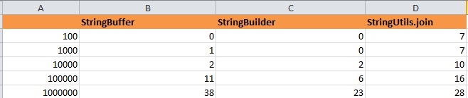

## Result ##
 
## Summary ##
- When there is a common dataset, performance:  StringUtils.join < StringBuffer =  StringBuilder
- When there is a large dataset, performance: StringBuffer < StringUtils.join < StringBuilder
## On the whole ##
- StringBuilder performance is best, but thread-unsafe
- StringBuffer performance is not good, but thread-safe
- StringUtils.join applies for large dataset and performance is little slower than StringBuilder, but its’ code is simple.
